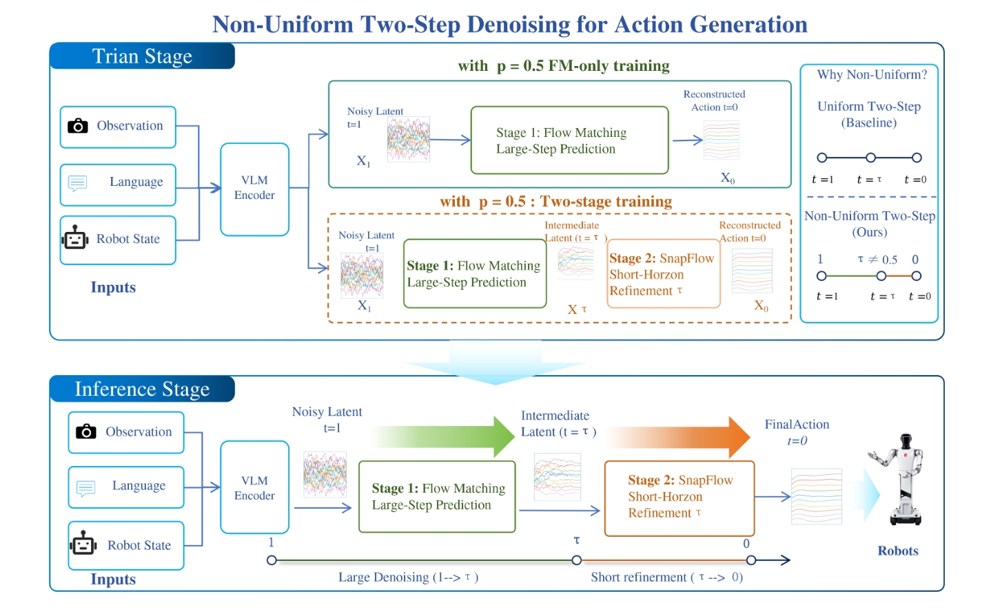

<div align="center">

# Toward Real-Time VLAs:<br>Stage-Aware Two-Step Flow Denoising and System-Level Evaluation

**Magiclab Robotics**

[📄 论文](main.pdf) · [🇬🇧 English](README.md) · [🔌 集成文档](client/integration/README.md)

[](https://www.python.org/)
[](https://developer.nvidia.com/tensorrt)
[](https://global.agilex.ai/product/piper)
[](LICENSE)

</div>

<p align="center">
  
</p>

## 📖 项目概览

本仓库提供一个用于在两台 Agilex Piper 机械臂上部署和评测实时 VLA 策略的分布式运行时。系统将观测采集、策略推理、动作发布和机器人控制解耦，使低频模型更新能够与高频物理执行并行运行。

配套论文测量了从相机和本体状态采集到机器人运动的完整时延链路，提出了分阶段 Flow Matching 去噪方法，并在长时域双臂服装折叠任务上比较了多种实时执行策略。

- **端到端时延：** 在同一运行时中记录相机、本体状态、模型、传输、调度和机器人响应时延。
- **分阶段 Flow Matching：** 使用非均匀时间表 `1 → 0.3 → 0`，组合长步 Flow 更新和末端细化。
- **实机执行：** 支持两台 Agilex Piper，并允许独立配置观测、推理、动作发布和控制频率。
- **可复现实验：** 通过统一接口、动作来源记录和无硬件 Mock 测试比较实时执行方法。

## 🚀 最新消息

- **[2026/09/30]** 🔥 发布源代码，包含论文、部署脚本、集成文档和无硬件 Mock 测试。

## 🛠️ 安装

运行时基于 **Python 3.11** 测试。推荐使用 [uv](https://docs.astral.sh/uv/) 创建虚拟环境并解析项目依赖。JAX checkpoint 后端需要兼容 CUDA 的 GPU 和 CUDA runtime；TensorRT 部署还需要安装匹配版本的 TensorRT。硬件客户端是可选组件，只有连接真实 Piper 设备时才需要额外安装 CAN 和相机依赖。

```bash
uv sync --python 3.11
. .venv/bin/activate
```

如果需要连接真实 Agilex Piper 机械臂，请安装以下机器人客户端依赖。这些依赖提供 Piper SDK 和相机接口；无硬件 Mock 流程不需要安装它们。

```bash
uv pip install -r client/requirements_inference.txt
sudo apt update
sudo apt install -y can-utils ethtool
```

## 📦 Policy 后端

| 后端 | 配置 | 用途 |
| --- | --- | --- |
| JAX checkpoint | `policy.type: checkpoint` | 研究和标准 Flow Matching 推理 |
| TensorRT engine | `policy.type: tensorrt` | 基于 CUDA/TensorRT 的优化部署 |
| 默认策略 | `policy.type: default` | 使用内置策略配置 |

对于 checkpoint，`policy.config` 必须与训练时使用的模型结构和 transforms 一致。归一化统计文件从以下路径加载：

```text
/path/to/checkpoint/assets/<asset_id>/norm_stats.json
```

## 🚀 快速开始

### 启动策略服务端

编辑 `server/config.yaml`，配置传输方式、监听端口、默认语言指令和策略后端。使用 checkpoint 时，将 `policy.config` 设置为训练时使用的模型结构，并将 `policy.dir` 指向导出的 checkpoint 目录。如果 checkpoint 包含多个 asset bundle，使用 `asset_id` 选择对应的归一化统计文件。

```yaml
transport: websocket
port: 8000
default_prompt: fold the sleeve

policy:
  type: checkpoint
  config: pi05_flatten_fold_normal
  dir: /path/to/checkpoint
  asset_id: OpenDriveLab-org/Kai0
```

保存配置后启动策略服务端。服务端会加载指定 checkpoint，打开配置的传输端口，并等待客户端观测请求：

```bash
./scripts/run_server.sh --config server/config.yaml
```

启动前可使用 `./scripts/run_server.sh --dry-run` 检查最终启动命令。

### 启动 Piper 客户端

启动客户端前，在 `client/config_agilex.yaml` 中配置策略服务端地址、CAN 接口名称、RealSense 序列号、机械臂初始姿态和运行频率。`inference_rate` 控制策略获取新观测的频率，`publish_rate` 控制向机器人发送动作的频率：

```yaml
server:
  host: 127.0.0.1
  port: 8000

inference:
  execution_mode: async
  async_mode: temporal_smoothing
  chunk_size: 50
  publish_rate: 30
  observation_rate: 30
  inference_rate: 3
  prompt: fold the sleeve
```

开始运动前先执行硬件检查：

```bash
./scripts/run_client.sh --config client/config_agilex.yaml --check-hardware
./scripts/run_client.sh --config client/config_agilex.yaml --log-level INFO
```

> ⚠️ 首次运行请降低速度，确认急停有效，并始终在机械臂工作空间外观察。

### 无硬件运行

```bash
./scripts/run_client_mock.sh
uv run pytest test packages server/openpi
```

## ⚙️ 实时执行模式

- **`naive`** — 在机器人执行当前动作的同时异步推理下一段动作。
- **`temporal_smoothing`** — 将上一动作块的尾部与新动作块的前缀进行平滑融合。
- **`temporal_ensembling`** — 聚合重叠动作预测。
- **`rtc`** — 使用已提交动作约束策略生成。
- **`legato`** — 学习原生动作连续性。
- **`ttrtc`** — 在训练阶段学习延迟感知的动作延续。
- **`vlash`** — 将动作与机器人预期未来状态对齐。

通过 `inference.async_mode` 选择模式，具体参数位于 `inference.modes.async.<mode>`。

## 🔌 部署

### 🌐 WebSocket

当 GPU 策略服务端和机器人客户端运行在不同主机时，使用 WebSocket。设置服务端端口，并将客户端配置指向策略服务器所在机器的可访问 IP。此模式适合由机器人计算机负责传感器和控制、独立工作站负责策略推理的部署方式：

```yaml
transport: websocket
port: 8000
```

### 🧠 共享内存

当策略服务端和机器人客户端运行在同一主机时，使用共享内存。Unix socket 路径必须同时对两个进程可访问；如果该路径已被其他服务占用，请修改为新的路径。共享内存可以避免网络序列化，适合同机低延迟部署：

```yaml
transport: shared_memory
shared_memory_socket_path: /tmp/openpi_policy.sock
```

### ⚡ TensorRT

当目标 GPU 和 CUDA/TensorRT 运行时固定后，可以将 ONNX 模型构建为 TensorRT engine。生成的 engine 与硬件及精度相关，建议在目标部署环境中构建。常见 CUDA 部署可使用 FP16，也可以根据模型和 GPU 选择其他支持的精度：

```bash
.venv/bin/python scripts/build_trt_engine.py \
  --onnx /path/to/model.onnx \
  --engine /path/to/model_fp16.engine
```

配置 `policy.type: tensorrt`、`engine`、`assets_dir`、`asset_id`、`device` 和 `precision`。

## 🗂️ 集成与记录

客户端记录默认写入 `client/inference_records/`。可以通过 `recording` 配置控制模型输入输出、视频、动作 CSV、运行事件和时序元数据。

- [采集服务集成](client/integration/README.md)
- [Inference Service TCP API](docs/INFERENCE_SERVICE_TCP_API.md)
- [Piper XH 时间轴集成](docs/PIPER_XH_TIMEAXIS_INTEGRATION.md)

```bash
cd client
python run_inference_service.py --config config_agilex.yaml --list-modes
python run_inference_service.py --config config_agilex.yaml --mode temporal_smoothing
```

## 🌐 VLA / WAM 生态

本运行时位于动作生成策略与真实机器人之间。

- **VLA 策略：** [OpenPI](https://github.com/Physical-Intelligence/openpi)、[OpenVLA](https://github.com/openvla/openvla)、[π₀ / π₀.₅](https://www.physicalintelligence.company/download/pi0.pdf) — 提供开源的视觉语言动作策略，用于动作生成和机器人控制。
- **机器人学习：** [LeRobot](https://github.com/huggingface/lerobot) — 提供统一的数据集、机器人、训练工具和评测接口。
- **World–Action Models：** [OpenWAM](https://github.com/OpenWAM-Official/OpenWAM)、[OpenWAM project](https://openwam.stanford.edu/) — 面向未来状态和视频条件建模，支持预测式机器人动作生成。

## 📁 仓库结构

```text
client/                  机器人运行时、配置、集成和工具
server/                  策略服务端与模型实现
packages/openpi-client/  WebSocket 与共享内存客户端
scripts/                 启动脚本、CAN 工具和 TensorRT 工具
docs/                    API 与集成说明
test/                    Mock fixtures 与测试
assets/paper/            README 使用的论文图
main.pdf                 论文
```

## 📝 引用

```bibtex
@article{wu2026closing,
  title  = {Toward Real-Time VLAs: Stage-Aware Two-Step Flow Denoising and System-Level Evaluation},
  author = {Wu, Di and Shen, Rongtian and Liu, Ping and Shen, Yan and Yin, Zhenhan and Zuo, Shun and Chen, Xuhua and Zheng, He and Zhang, Lingfeng and Zhang, Jianglin and Zhang, Tao},
  year   = {2026}
}
```

## 📜 许可证

[Apache License 2.0](LICENSE)
